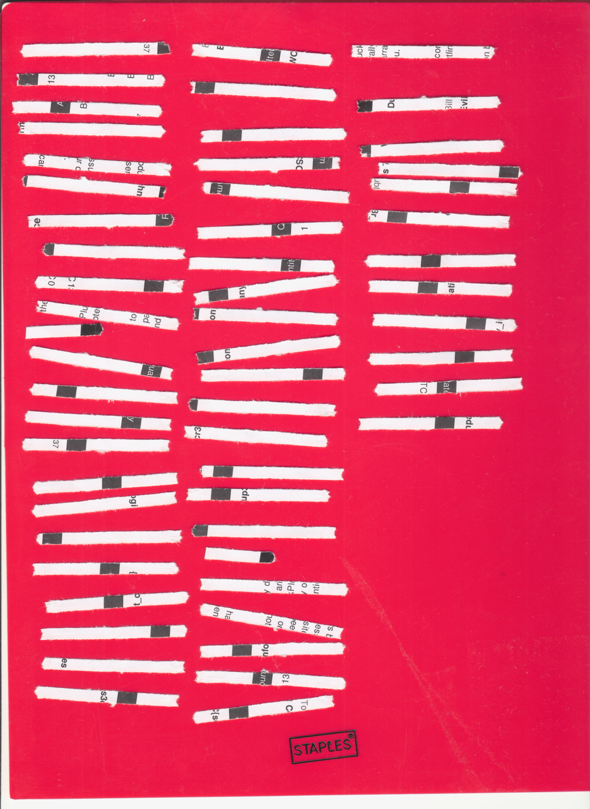
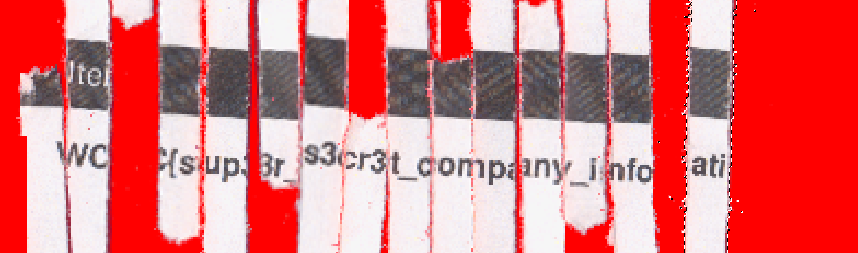

# Shredded Write-up
---

### Initial Exposure
This is a little different as there was not really any programming or scripting to speak of. The pack of clues we are given include this image

Which is a bunch of shredded paper on a solid colored background. If you notice all of the paper is kind of pointed. This gives a clue as to the proper orientation. To solve this I would recommend just printing the image out, cutting out the strips, and rearranging them by hand using the pdf of the invoice as a guide. Important thing to notice is that some strips of paper are missing and most of the paper doesn't contain the flag. 

After a long time sorting the strips of paper I eventually got enough information to get the flag.

WCFC{sup3r_s3cr3t_company_information}