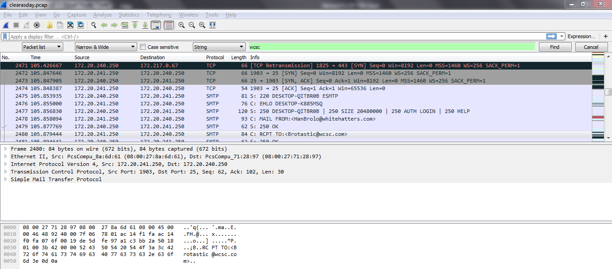
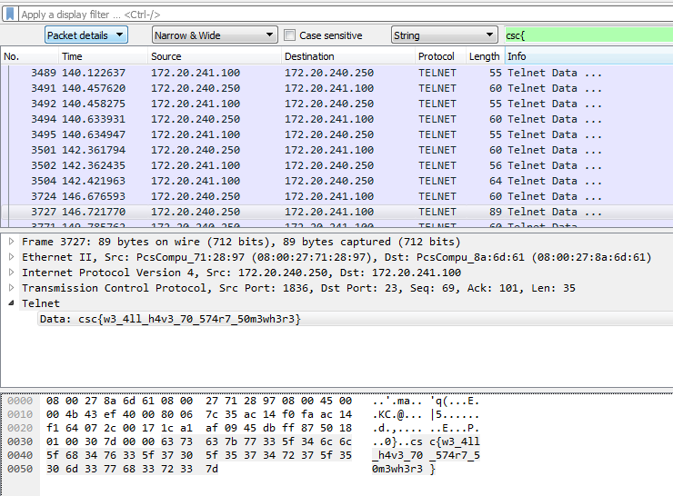

# Clear As Day Write-up
---

### Initial Exposure

We downloaded a pcap file which is a standard format for packet capture which can be opened in Wireshark. The clue and the name of the challenge suggests that there is no encryption on the flag. 

### Wireshark

The first thing I did after opening the file in Wireshark was to do a simple Find (CTRL+F) for wcsc, which is the beginning of the flag. 

Searching the results did not find the flag however, which means it might be split up between two packets. Thinking this I tried wcs and csc{. Sure enough this revealed the flag, minus the leading w which is in the previous packet. 

###### Tylor Childers