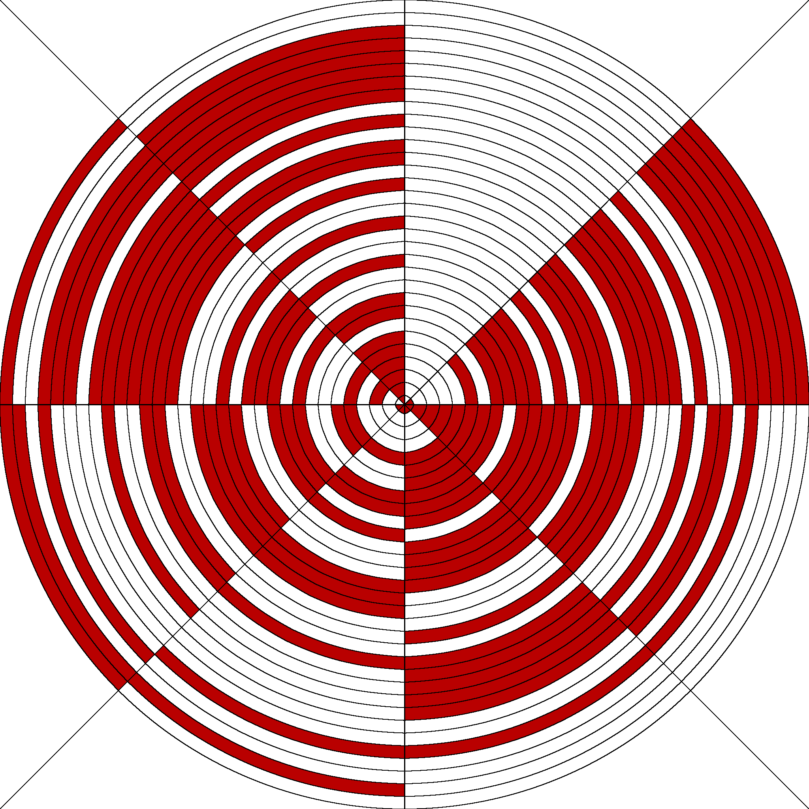
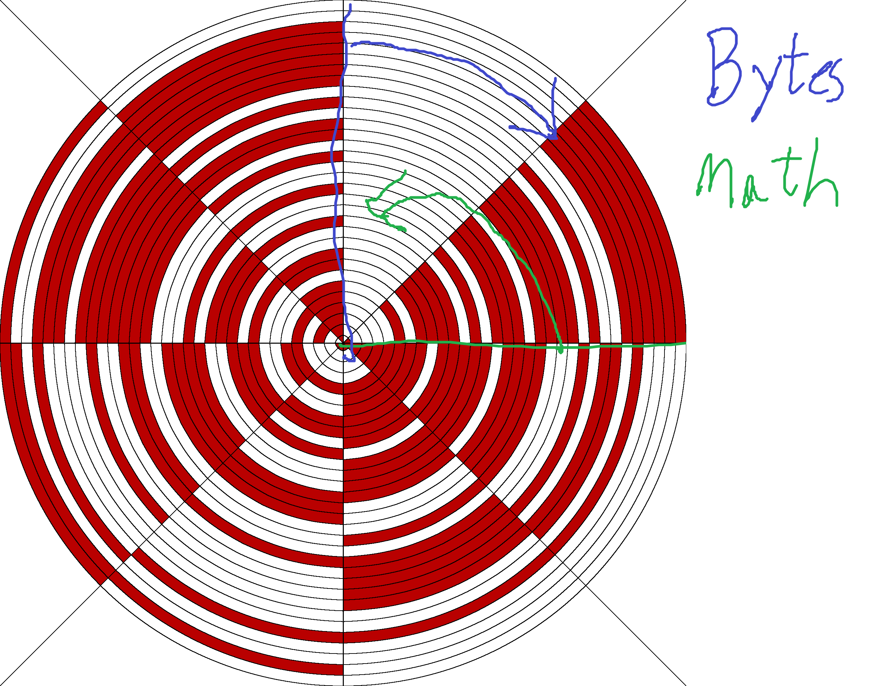

# Crop Circles Write-up
---

### Initial Exposure

The image file we download contains 31 circles divided into 8 segments. The segments are colored red and white in a seemingly random order.

 

Each circle has 8 segments with two states (red or white). My initial reaction was that each circle represented a byte, with red being 1 and white being 0. This was supported by the fact that there was an entire 'pie slice' that was white, which would match up with ASCII since all ASCII characters have the first bit set to 0. Manually converting the outermost circle, starting at the slice just clockwise of 12 o' clock and moving clockwise, gives us a byte of 01000110 which is 0x46 or F, which is probably the start of FLAG. This means we need to write a script to sample the color of each ring at 45 degree intervals (360/8=45) starting somewhere between 0 and 45 to make sure we get in the colored zone. I'll use 22 in this writeup. This will give us the flag. 

### Geometry

Back to Trigonometry for a little bit to write the Python script. We need a way to convert the radial (radius and angle) measurements into cartesean (x and y) measurements. The formulas are 
```
x = r * cos(θ)
y = r * sin(θ)
```
It's important to note that Python 2.7's math (blue below) library uses radians instead of degrees. It also defines angles counter-clockwise starting along the positive x axis. However the image (green below) goes clockwise and starts along the positive Y axis.



This is pretty easy to correct mathematically. To rotate the angle forward by 90 degrees we just subtract 90 from the angle so 22 becomes -72. To reverse the rotation we simply negate the angle, -72 becomes 72. Finally to convert to radians multiply by 2*pi/360, 72 degrees becomes 1.26 radians. In Python this looks like
```python

def angleConvert(deg):
    t = -(deg-90) * 2 * 3.14 / 360
    return t

```
This gives us our theta (θ) properly aligned. The next thing is the radius. The image is 2048 pixels in height and width and there are 32 circles. Each circle is then 2048/64 pixels wide which is 32 pixels. This means the center of each ring, i, is at i*32+16 (We add 16 to get to the middle of the ring. If we didn't the coordinate would be on the border.) This can be written as
```python

def getRadius(index):
    r = index*32+14
    return r

```

Now we have everything we need to convert a radial point to an x and y coordinate on the image. Then we just need two for loops, one to select the ring from 31 to 0, and the second to select the section from 7 to 0. Since 0,0 is in the upper left corner, moving that to the center of the circle means subtracting 1024 from the x values and adding 1024 to the y values. This remaps the origin to 1024,1024. The last bit of logic is to compare the color value to red and set the corresponding bit if it is red. 

Full program:

```python

#!/usr/bin/python2
from PIL import Image
from math import cos,sin

reader = Image.open('cropcircles.png')
p = list(reader.getdata())

def angleConvert(deg):
    t = -(deg-90) * 2 * 3.14 / 360
    return t

def getRadius(index):
    r = index*32+14
    return r

def radialToCart(rad,angle):
    x = rad * cos(angle) + 1024
    y = 1024 - rad * sin(angle)
    return (int(x),int(y))

s=""

for c in reversed(range(32)):
    byte = 0
    for b in reversed(range(8)):
        (x,y) = radialToCart(getRadius(c),angleConvert(22+45*b))
        if p[2048*y+x][0] == 185:
            byte += pow(2,7-b)
    s+=chr(byte)

print s

```
Which gives us the flag: FLAG{C!3V3R_Gr!ll_4r3nt_y0u?!#!}

###### Tylor Childers